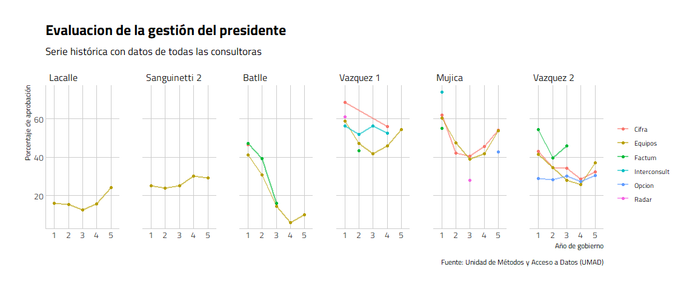
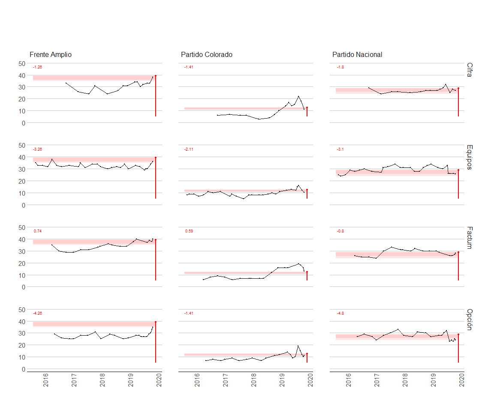

<!-- README.md is generated from README.Rmd. Please edit that file -->

# op<b style='color:blue'>uy</b> 

*Nicolás Schmidt, Daniela Vairo, Martín Opertti,
UMAD<sup><a id="fnr.1" class="footref" href="#fn.1">1</a></sup>.*

<!-- badges: start -->

[](https://CRAN.R-project.org/package=opuy)
[](https://github.com/Nicolas-Schmidt/opuy/actions/workflows/R-CMD-check.yaml)
[](https://www.repostatus.org/#active)
[](https://github.com/Nicolas-Schmidt/opuy)
[](https://opensource.org/licenses/MIT)
[](https://zenodo.org/badge/latestdoi/253661638)

<!-- badges: end -->

> Datos de opinón pública de Uruguay de 1989 hasta la actualidad.

### Descripción

Provee un conjunto de datos de opinión publica en Uruguay para el
periodo que va desde 1989 hasta la actualidad de dos indicadores
relevante para el estudio de la realidad política del país: **intención
de voto** y **evaluación de gestión del presidente**.

El manual del paquete se puede encontrar
[**aquí**](https://github.com/Nicolas-Schmidt/opuy/blob/master/man/figures/Manual_opuy.pdf).

### Instalación

``` r
remotes::install_github("Nicolas-Schmidt/opuy")
```

### Contenido del paquete

#### Funciones

| Nombre         | Descripción                                                                                                                                                 |
|----------------|-------------------------------------------------------------------------------------------------------------------------------------------------------------|
| `resumen_opuy` | Resumen de los indicadores que contiene la base de datos por consultora y por año. Esta función tiene asociado su propio método de `print()` y `summary()`. |

#### Conjuntos de datos

| Nombre | Descripción                                                                                                                                                                                                                                                                                                           |
|--------|-----------------------------------------------------------------------------------------------------------------------------------------------------------------------------------------------------------------------------------------------------------------------------------------------------------------------|
| `opuy` | Conjunto de datos que contiene dos indicadores de opinión pública relevante para trabajar con datos políticos para el período 1989 hasta la actualdiad: **Intención de voto** y **Evaluación de la gestión del Presidente**. Los valores para ambos indicadores son agregados ya que no se cuenta con los microdatos. |

### Ejemplo

``` r
## Conjunto de datos: 'opuy'

library(opuy)

summary(resumen_opuy())
#> # A tibble: 12 × 6
#>    Empresa      Indicador                        Mediciones Periodo  Anios Ratio
#>    <chr>        <chr>                                 <int> <chr>    <dbl> <dbl>
#>  1 Equipos      Evaluacion de gestion presidente        190 1990-20…    32     6
#>  2 Cifra        Evaluacion de gestion presidente         52 2000-20…    23     2
#>  3 Opcion       Evaluacion de gestion presidente         30 2014-20…     9     3
#>  4 Factum       Evaluacion de gestion presidente         27 2000-20…    21     1
#>  5 Interconsult Evaluacion de gestion presidente         15 2005-20…     5     3
#>  6 Radar        Evaluacion de gestion presidente          3 2005-20…     7     0
#>  7 Factum       Intencion de voto                       149 1993-20…    26     6
#>  8 Equipos      Intencion de voto                       114 1989-20…    30     4
#>  9 Cifra        Intencion de voto                        90 1993-20…    26     3
#> 10 Radar        Intencion de voto                        69 1998-20…    21     3
#> 11 Interconsult Intencion de voto                        64 1998-20…    19     3
#> 12 Opcion       Intencion de voto                        29 2014-20…     5     6

resumen_opuy(polling.org = c("Equipos", "Cifra", "Factum", "Opcion"))
#> 
#> 
#> ---- Resumen de Indicadores por anio y consultora ---------------------------
#> 
#> 
#>           Equipos          Cifra          Factum          Opcion     
#> ----- --------------- --------------- --------------- ---------------
#> 1989  IV (06)|   -       -   |   -       -   |   -       -   |   -   
#> 1990  IV (01)|EG (02)    -   |   -       -   |   -       -   |   -   
#> 1991  IV (02)|EG (02)    -   |   -       -   |   -       -   |   -   
#> 1992  IV (02)|EG (03)    -   |   -       -   |   -       -   |   -   
#> 1993  IV (06)|EG (06) IV (08)|   -    IV (03)|   -       -   |   -   
#> 1994  IV (11)|EG (12) IV (11)|   -    IV (12)|   -       -   |   -   
#> 1995     -   |EG (08)    -   |   -    IV (01)|   -       -   |   -   
#> 1996     -   |EG (12)    -   |   -    IV (03)|   -       -   |   -   
#> 1997  IV (01)|EG (12)    -   |   -    IV (08)|   -       -   |   -   
#> 1998  IV (01)|EG (12)    -   |   -    IV (13)|   -       -   |   -   
#> 1999  IV (09)|EG (06) IV (07)|   -    IV (16)|   -       -   |   -   
#> 2000     -   |EG (03)    -   |EG (02) IV (01)|EG (07)    -   |   -   
#> 2001     -   |EG (04)    -   |   -    IV (03)|EG (07)    -   |   -   
#> 2002  IV (01)|EG (04)    -   |   -    IV (03)|EG (01)    -   |   -   
#> 2003     -   |EG (04) IV (03)|   -    IV (03)|   -       -   |   -   
#> 2004  IV (07)|EG (04) IV (10)|   -    IV (15)|   -       -   |   -   
#> 2005     -   |EG (05)    -   |EG (02)    -   |   -       -   |   -   
#> 2006     -   |EG (06)    -   |   -       -   |EG (02)    -   |   -   
#> 2007     -   |EG (06)    -   |   -    IV (02)|   -       -   |   -   
#> 2008  IV (01)|EG (06) IV (03)|EG (01) IV (04)|   -       -   |   -   
#> 2009  IV (10)|EG (05) IV (11)|   -    IV (11)|   -       -   |   -   
#> 2010  IV (03)|EG (06)    -   |EG (02) IV (02)|EG (01)    -   |   -   
#> 2011  IV (06)|EG (02) IV (01)|EG (04) IV (04)|   -       -   |   -   
#> 2012  IV (03)|EG (04) IV (04)|EG (06) IV (04)|   -       -   |   -   
#> 2013  IV (02)|EG (04) IV (06)|EG (03) IV (05)|   -       -   |   -   
#> 2014  IV (11)|EG (05) IV (10)|EG (05) IV (14)|   -    IV (06)|EG (02)
#> 2015  IV (03)|EG (06)    -   |EG (02)    -   |EG (03)    -   |EG (01)
#> 2016  IV (05)|EG (05) IV (01)|EG (03) IV (04)|EG (03) IV (03)|EG (05)
#> 2017  IV (06)|EG (03) IV (03)|EG (03) IV (04)|EG (01) IV (05)|EG (04)
#> 2018  IV (06)|EG (04) IV (04)|EG (04) IV (04)|   -    IV (04)|EG (04)
#> 2019  IV (11)|EG (01) IV (08)|EG (02) IV (10)|   -    IV (11)|EG (03)
#> 2020     -   |EG (07)    -   |EG (03)    -   |   -       -   |EG (02)
#> 2021     -   |EG (12)    -   |EG (05)    -   |EG (02)    -   |EG (04)
#> 2022     -   |EG (09)    -   |EG (04)    -   |   -       -   |EG (04)
#> 2023     -   |   -       -   |EG (01)    -   |   -       -   |EG (01)
#> 
#> 
#> IV: Intencion de Voto
#> EG: Evaluacion de gestion
#> 
#> Entre parentesis se indica la cantidad de mediciones.
#> 
#> -----------------------------------------------------------------------------
```

#### Intención de voto para elecciones nacionales medidas en 2019 por todas las consultoras

``` r
library(tidyverse)

data(opuy)

opuy %>%
    filter(medicion == 'Intencion de voto',
           tipo_eleccion == 'Nacional',
           anio_medicion == 2019, 
           sigla %in% c('FA', 'PC', 'PN', 'CA')) %>% 
    mutate(partido = factor(partido, levels = c('Frente Amplio', 'Partido Colorado', 
                                                'Partido Nacional', 'Cabildo Abierto'))) %>% 
    ggplot(aes(x = fecha, y = valor, color = empresa)) +
    geom_line(aes(group = empresa), size = 1, alpha = 0.6) +
    geom_point(size = 1.5) +
    facet_wrap(~partido, nrow = 1) +
    hrbrthemes::theme_ipsum_tw(grid = "XY", axis = "xy") +
    labs(x = "",
         y = "Porcentaje de votos %",
         color = "",
         title = "Intención de voto en elecciones nacionales 2019",
         subtitle = '27 de octubre de 2019 \nMediciones del año 2019',
         caption = 'Fuente: opuy (Schmidt et al. 2022)')
```


#### Intención de voto para elecciones nacionales de todas las consultoras para todo el período de medición de la elección de 2019 (2016 - 2019)


#### Resumen intención de voto 2019 de los principales partidos para toda la serie correspondiente a la elección nacional de 2019 (2016 - 2019)

| Partido          | Valor Mínimo | Valor Máximo | Valor Mínimo 2019 | Valor Máximo 2019 | Votación real |
|:-----------------|:-------------|:-------------|:------------------|:------------------|:--------------|
| Frente Amplio    | 24%          | 43%          | 27%               | 43%               | 39.25%        |
| Partido Nacional | 21.6%        | 34%          | 21.6%             | 33%               | 28.79%        |
| Partido Colorado | 3%           | 22%          | 9%                | 22%               | 12.41%        |
| Cabildo Abierto  | 1%           | 12%          | 1%                | 12%               | NA%           |

#### Evaluación de la gestión del presidente

``` r
opuy %>%
    filter(medicion == 'Evaluacion de gestion presidente',
           categoria_unificada == 3) %>%
    select(anio_gobierno, empresa, valor, presidente) %>%
    group_by(empresa, anio_gobierno, presidente) %>%
    summarise(promedio = mean(valor, na.rm = TRUE)) %>%
    ungroup() %>%
    mutate(presidente = factor(presidente, levels = c("Lacalle", "Sanguinetti 2", 
                                                      "Batlle", "Vazquez 1", "Mujica", 
                                                      "Vazquez 2", "Lacalle Pou"))) %>% 
    ggplot(aes(x = factor(anio_gobierno), y = promedio, color = empresa)) +
    geom_line(aes(group = empresa), size = 1, alpha = 0.6) +
    geom_point(size = 1.5) +
    facet_wrap(~presidente, nrow = 1) +
    hrbrthemes::theme_ipsum_tw(grid = "XY", axis = "xy") +
    labs(x = "Año de gobierno",
         y = "Porcentaje de aprobación",
         color = "", 
         title = "Evaluacion de la gestión del presidente",
         subtitle = 'Serie histórica con datos de todas las consultoras (promedios anuales)',
         caption = 'Fuente: opuy (Schmidt et al. 2022)')
```



#### Uso combinado del paquete `opuy` con [`Boreluy`](https://nicolas-schmidt.github.io/Boreluy/) (paquete de R de datos electorales de Uruguay)

La paleta grafica que se presenta contiene los datos de cuatro
consultores sobre intención de voto de cara a la elección de octubre de
2019. La recta y el punto rojo indica el resultado que cada partido
obtuvo en la elección. La franja roja horizontal se conforma con los
puntos de la última intención de voto de cada consultora y el resultado
de la elección. El número rojo arriba a la izquierda de cada grafico
indica le distancia de la última estimación con el resultado de la
elección.



#### :bookmark_tabs: Citar

Para citar el uso de los datos o del paquete `opuy` en publicaciones
use:

**Schmidt, Nicolás, Vairo, Daniela, Opertti, Martín , UMAD (2022) opuy:
Datos de Opinión Pública de Uruguay 1989 a la actualidad, R package
version 0.1.1001, <https://nicolas-schmidt.github.io/opuy/>.**

------------------------------------------------------------------------

##### Mantenedor

Nicolás Schmidt (<nschmidt@cienciassociales.edu.uy>)

#### Notas

------------------------------------------------------------------------

<sup><a id="fn.1" href="#fnr.1">1</a></sup> Unidad de Métodos y Acceso a
Datos, Facultad de Ciencias Sociales, Universidad de la República
(UMAD-FCS-UdelaR)
