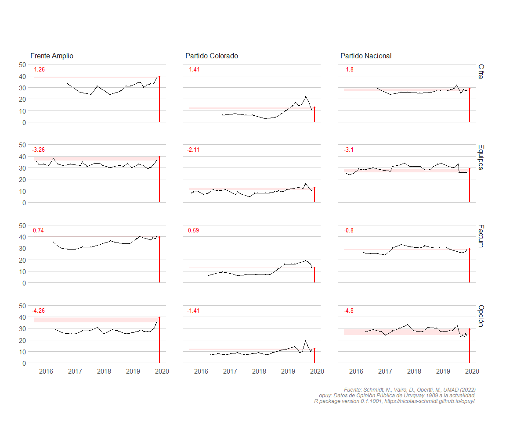

<!-- README.md is generated from README.Rmd. Please edit that file -->

# op<b style='color:blue'>uy</b> 

*Nicolás Schmidt, Daniela Vairo, Martín Opertti,
UMAD<sup><a id="fnr.1" class="footref" href="#fn.1">1</a></sup>.*

<!-- badges: start -->

[](https://CRAN.R-project.org/package=opuy)
[](https://github.com/Nicolas-Schmidt/opuy/actions/workflows/R-CMD-check.yaml)
[](https://www.repostatus.org/#active)
[](https://github.com/Nicolas-Schmidt/opuy)
[](https://opensource.org/licenses/MIT)
[](https://zenodo.org/badge/latestdoi/253661638)

<!-- badges: end -->

> Uruguayan Public Opinion Data From 1989 to the Present.

### Description

OPUY provides a set of Uruguay’s public opinion data since 1989. The
data features two relevant indicators for the study of the Uruguay’s
political behavior: **vote intention** and **presidential approval**.

The package manual can be found
[**here**](https://github.com/Nicolas-Schmidt/opuy/blob/master/man/figures/Manual_opuy.pdf).

### Install

``` r
remotes::install_github("Nicolas-Schmidt/opuy")
```

### Package Features

#### Functions

| Name           | Description                                                                                                             |
|----------------|-------------------------------------------------------------------------------------------------------------------------|
| `resumen_opuy` | A summary of the indicators the dataset contains by year. This function has it’s own `print()` and `summary()` methods. |

#### Data

| Name   | Description                                                                                                                                                                                                                                                                                                                                        |
|--------|----------------------------------------------------------------------------------------------------------------------------------------------------------------------------------------------------------------------------------------------------------------------------------------------------------------------------------------------------|
| `opuy` | Datset that contains two public opinion indicators: **vote intention** and **presidential approval**. Data available ranges from 1989 to the present. Data was collected from polling organizations records and news articles by Unidad de Métodos y Acceso a Datos. All data is at the aggregate level, as no individual-level data is available. |

### Example

``` r
## Dataset: 'opuy'

library(opuy)

summary(resumen_opuy())
#> # A tibble: 12 × 6
#>    Empresa      Indicador                        Mediciones Periodo  Anios Ratio
#>    <chr>        <chr>                                 <int> <chr>    <dbl> <dbl>
#>  1 Equipos      Evaluacion de gestion presidente        193 1990-20…    33     6
#>  2 Cifra        Evaluacion de gestion presidente         53 2000-20…    23     2
#>  3 Opcion       Evaluacion de gestion presidente         31 2014-20…     9     3
#>  4 Factum       Evaluacion de gestion presidente         27 2000-20…    21     1
#>  5 Interconsult Evaluacion de gestion presidente         15 2005-20…     5     3
#>  6 Radar        Evaluacion de gestion presidente          3 2005-20…     7     0
#>  7 Factum       Intencion de voto                       154 1993-20…    30     5
#>  8 Equipos      Intencion de voto                       117 1989-20…    34     3
#>  9 Cifra        Intencion de voto                        93 1993-20…    30     3
#> 10 Radar        Intencion de voto                        69 1998-20…    21     3
#> 11 Interconsult Intencion de voto                        64 1998-20…    19     3
#> 12 Opcion       Intencion de voto                        29 2014-20…     5     6

resumen_opuy(polling.org = c("Equipos", "Cifra", "Factum", "Opcion"))
#> 
#> 
#> ---- Resumen de Indicadores por anio y consultora ---------------------------
#> 
#> 
#>           Equipos          Cifra          Factum          Opcion     
#> ----- --------------- --------------- --------------- ---------------
#> 1989  IV (06)|   -       -   |   -       -   |   -       -   |   -   
#> 1990  IV (01)|EG (02)    -   |   -       -   |   -       -   |   -   
#> 1991  IV (02)|EG (02)    -   |   -       -   |   -       -   |   -   
#> 1992  IV (02)|EG (03)    -   |   -       -   |   -       -   |   -   
#> 1993  IV (06)|EG (06) IV (08)|   -    IV (03)|   -       -   |   -   
#> 1994  IV (11)|EG (12) IV (11)|   -    IV (12)|   -       -   |   -   
#> 1995     -   |EG (08)    -   |   -    IV (01)|   -       -   |   -   
#> 1996     -   |EG (12)    -   |   -    IV (03)|   -       -   |   -   
#> 1997  IV (01)|EG (12)    -   |   -    IV (08)|   -       -   |   -   
#> 1998  IV (01)|EG (12)    -   |   -    IV (13)|   -       -   |   -   
#> 1999  IV (09)|EG (06) IV (07)|   -    IV (16)|   -       -   |   -   
#> 2000     -   |EG (03)    -   |EG (02) IV (01)|EG (07)    -   |   -   
#> 2001     -   |EG (04)    -   |   -    IV (03)|EG (07)    -   |   -   
#> 2002  IV (01)|EG (04)    -   |   -    IV (03)|EG (01)    -   |   -   
#> 2003     -   |EG (04) IV (03)|   -    IV (03)|   -       -   |   -   
#> 2004  IV (07)|EG (04) IV (10)|   -    IV (15)|   -       -   |   -   
#> 2005     -   |EG (05)    -   |EG (02)    -   |   -       -   |   -   
#> 2006     -   |EG (06)    -   |   -       -   |EG (02)    -   |   -   
#> 2007     -   |EG (06)    -   |   -    IV (02)|   -       -   |   -   
#> 2008  IV (01)|EG (06) IV (03)|EG (01) IV (04)|   -       -   |   -   
#> 2009  IV (10)|EG (05) IV (11)|   -    IV (11)|   -       -   |   -   
#> 2010  IV (03)|EG (06)    -   |EG (02) IV (02)|EG (01)    -   |   -   
#> 2011  IV (06)|EG (02) IV (01)|EG (04) IV (04)|   -       -   |   -   
#> 2012  IV (03)|EG (04) IV (04)|EG (06) IV (04)|   -       -   |   -   
#> 2013  IV (02)|EG (04) IV (06)|EG (03) IV (05)|   -       -   |   -   
#> 2014  IV (11)|EG (05) IV (10)|EG (05) IV (14)|   -    IV (06)|EG (02)
#> 2015  IV (03)|EG (06)    -   |EG (02)    -   |EG (03)    -   |EG (01)
#> 2016  IV (05)|EG (05) IV (01)|EG (03) IV (04)|EG (03) IV (03)|EG (05)
#> 2017  IV (06)|EG (03) IV (03)|EG (03) IV (04)|EG (01) IV (05)|EG (04)
#> 2018  IV (06)|EG (04) IV (04)|EG (04) IV (04)|   -    IV (04)|EG (04)
#> 2019  IV (11)|EG (01) IV (08)|EG (02) IV (10)|   -    IV (11)|EG (03)
#> 2020     -   |EG (07)    -   |EG (03)    -   |   -       -   |EG (02)
#> 2021     -   |EG (12)    -   |EG (05) IV (01)|EG (02)    -   |EG (04)
#> 2022  IV (01)|EG (09) IV (01)|EG (04) IV (02)|   -       -   |EG (04)
#> 2023  IV (02)|EG (03) IV (02)|EG (02) IV (02)|   -       -   |EG (02)
#> 
#> 
#> IV: Intencion de Voto
#> EG: Evaluacion de gestion
#> 
#> Entre parentesis se indica la cantidad de mediciones.
#> 
#> -----------------------------------------------------------------------------
```

#### Presidential Approval in Uruguay

``` r
library(tidyverse)
library(hrbrthemes)

data(opuy)

dias_sumar <- Sys.Date() - as.Date("2020-03-01")

annotation <- tibble(x = as.Date(c("1992-01-01","1997-06-06", "2002-06-06", "2007-06-06",
                                   "2012-06-06", "2017-06-06", "2022-01-01")),
                     y = 85,
                     label = c("Lacalle","Sanguinetti II", "Batlle", "Vázquez I",
                               "Mujica", "Vázquez II", "Lacalle Pou"),
                     comienzo = as.Date(c("1990-03-01", "1995-03-01", "2000-03-01", "2005-03-01",
                                          "2010-03-01", "2015-03-01", "2020-03-01"))) %>%
    mutate(ahora = comienzo + dias_sumar)

fechas <- as.Date(c("1995-03-01","2000-03-01", "200-03-01", "2010-03-01", "2015-03-01", "2020-03-01"))

colores <- c("#99ccff", "#BA0200", "#BA0200", "#013197", "#013197", "#013197", "#99ccff")

opuy %>%
    filter(medicion == 'Evaluacion de gestion presidente',
           categoria_unificada == 3) %>%
    select(fecha, empresa, valor, presidente) %>%
    mutate(presidente = factor(presidente, levels = c("Lacalle", "Sanguinetti 2",
                                                      "Batlle", "Vazquez 1", "Mujica",
                                                      "Vazquez 2", "Lacalle Pou"))) %>%
    ggplot(aes(x = fecha, y = valor, color = presidente)) +
    geom_smooth(aes(group = presidente), method="loess", se=FALSE) +
    geom_point(size = 2, alpha=0.3) +
    geom_vline(xintercept = as.numeric(fechas), linetype="dashed", size=0.3, color="grey30") +
    theme_minimal() +
    theme(legend.position = "none") +
    labs(y = "Porcentaje de aprobación",
         x = "",
         title = "Aprobación del presidente (serie histórica)",
         caption = 'Fuente: opuy (Schmidt et al. 2022)'
         ) +
    geom_text(data=annotation, aes( x=x, y=y, label=label),
              color="black", size=4) +
    scale_fill_manual(name = "", values = colores) +
    scale_color_manual(name = "", values = colores) +
    scale_x_date(date_breaks = "2 years", date_minor_breaks = "1 year",
                 date_labels = "%Y", limits = c(as.Date("1990-01-01"), NA)) +
    annotate("rect",
             xmin = annotation$comienzo,
             xmax = annotation$ahora,
             ymin = 0,
             ymax = Inf, alpha = .1)
```


#### Combined use of `opuy` package with [`Boreluy`](https://nicolas-schmidt.github.io/Boreluy/) (R package with electoral data from Uruguay)

The graphic palette presented contains data from four polling
organizations on voting intentions for the October 2019 national
election. The line and the red dot indicate the result that each party
obtained in the election. The horizontal red band is made up of the
points of the last vote intention measurement of each polling
organization and the result of the election. The red number at the top
left of each graph indicates the distance between the last estimate and
the result of the election.



#### :bookmark_tabs: Citation

Pleas cite the use of data or `opuy` package. Use the following
citation:

**Schmidt, Nicolás, Vairo, Daniela, Opertti, Martín , UMAD (2022) opuy:
Datos de Opinión Pública de Uruguay 1989 a la actualidad, R package
version 0.1.1001, <https://nicolas-schmidt.github.io/opuy/>.**

------------------------------------------------------------------------

##### Maintainer

Nicolás Schmidt (<nschmidt@cienciassociales.edu.uy>)

#### Notes

------------------------------------------------------------------------

<sup><a id="fn.1" href="#fnr.1">1</a></sup> Unidad de Métodos y Acceso a
Datos, Facultad de Ciencias Sociales, Universidad de la República
(UMAD-FCS-UdelaR)
