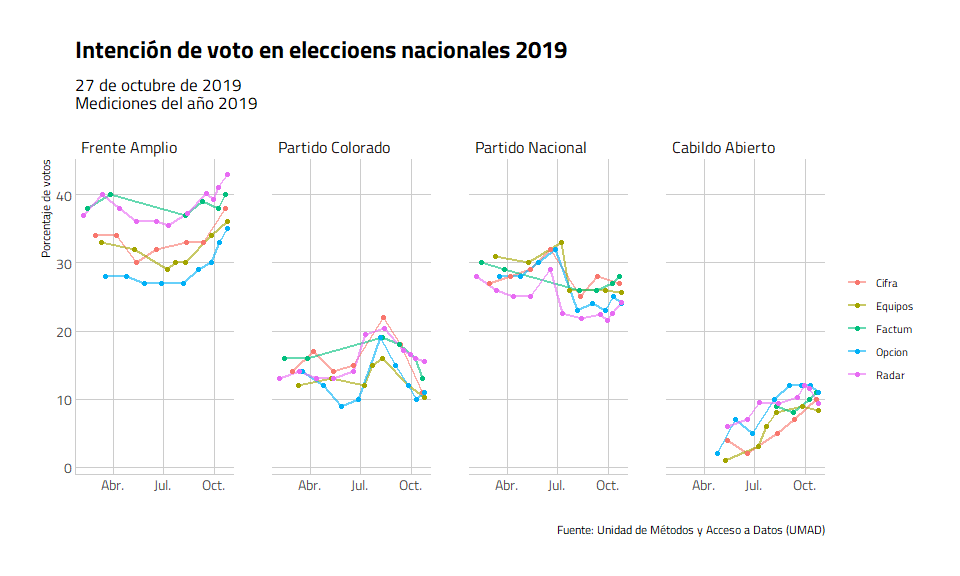
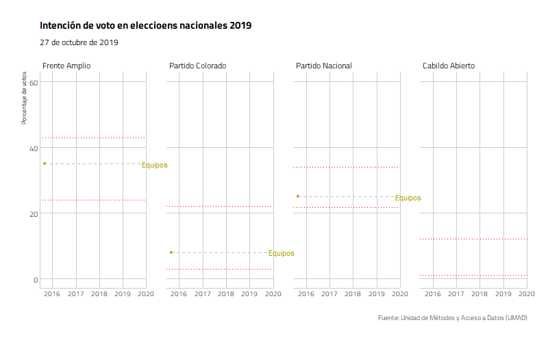

<!-- README.md is generated from README.Rmd. Please edit that file -->

# opuy

*Nicolás Schmidt, Daniela Vairo,
UMAD<sup><a id="fnr.1" class="footref" href="#fn.1">1</a></sup>.*

<!-- badges: start -->

[](https://www.repostatus.org/#active)

[](https://opensource.org/licenses/MIT)

<!-- badges: end -->

> Datos de opinón pública de Uruguay 1989 - 2020.

### Descripción

Provee un conjunto de datos de opinión publica en Uruguay en el periodo
que va desde 1989 hasta 2020.

El manual del paquete se puede encontrar
[**aquí**](https://github.com/Nicolas-Schmidt/Boreluy/blob/master/man/figures/Manual_opuy.pdf).

### Instalación

``` r
## Versión en desarrollo
source("https://install-github.me/Nicolas-Schmidt/opuy")
```

### Contenido del paquete

#### Funciones

| Nombre         | Descripción                                                             |
| -------------- | ----------------------------------------------------------------------- |
| `resumen_opuy` | Resumen de los indicadores que contiene la base de datos por consultora |

#### Conjuntos de datos

| Nombre | Descripción                                                                                                                                                                                                                                                                                                                                                                                     |
| ------ | ----------------------------------------------------------------------------------------------------------------------------------------------------------------------------------------------------------------------------------------------------------------------------------------------------------------------------------------------------------------------------------------------- |
| `opuy` | Conjunto de datos que contiene dos indicadores de opinión pública relevante para trabajar con datos políticos para el período 1989 - 2020: **Intención de voto** y **Evaluación de la gestión del Presidente**. Los valores para ambos indicadores son agregados ya que no se cuenta con los microdatos. La fuente de los datos es el Banco de Datos de la Faculta de Ciencias Sociales (UMAD). |

#### Ejemplo

``` r
## Conjunto de datos: 'opuy'

library(opuy)

resumen_opuy()
#>            Cifra     Equipos      Factum Interconsult      Opcion       Radar
#> ---- ----------- ----------- -----------  ----------- ----------- -----------
#> 1989       - | -       IV| -       - | -        - | -       - | -       - | -
#> 1990       - | -       IV|EG       - | -        - | -       - | -       - | -
#> 1991       - | -       IV|EG       - | -        - | -       - | -       - | -
#> 1992       - | -       IV|EG       - | -        - | -       - | -       - | -
#> 1993       IV| -       IV|EG       IV| -        - | -       - | -       - | -
#> 1994       IV| -       IV|EG       IV| -        - | -       - | -       - | -
#> 1995       - | -       - |EG       IV| -        - | -       - | -       - | -
#> 1996       - | -       - |EG       IV| -        - | -       - | -       - | -
#> 1997       - | -       IV|EG       IV| -        - | -       - | -       - | -
#> 1998       - | -       IV|EG       IV| -        IV| -       - | -       IV| -
#> 1999       IV| -       IV|EG       IV| -        IV| -       - | -       IV| -
#> 2000       - |EG       - |EG       IV|EG        - | -       - | -       - | -
#> 2001       - | -       - |EG       IV|EG        - | -       - | -       - | -
#> 2002       - | -       IV|EG       IV|EG        - | -       - | -       - | -
#> 2003       IV| -       - |EG       IV| -        IV| -       - | -       IV| -
#> 2004       IV| -       IV|EG       IV| -        IV| -       - | -       IV| -
#> 2005       - |EG       - |EG       - | -        IV|EG       - | -       - |EG
#> 2006       - | -       - |EG       - |EG        IV|EG       - | -       - | -
#> 2007       - | -       - |EG       IV| -        IV|EG       - | -       - | -
#> 2008       IV|EG       IV|EG       IV| -        IV|EG       - | -       IV| -
#> 2009       IV| -       IV|EG       IV| -        IV| -       - | -       IV| -
#> 2010       - |EG       IV|EG       IV|EG        - |EG       - | -       - | -
#> 2011       IV|EG       IV|EG       IV| -        - | -       - | -       - | -
#> 2012       IV|EG       IV|EG       IV| -        - | -       - | -       IV|EG
#> 2013       IV|EG       IV|EG       IV| -        IV| -       - | -       IV| -
#> 2014       IV|EG       IV|EG       IV| -        IV| -       IV|EG       IV| -
#> 2015       - |EG       IV|EG       - |EG        - | -       - |EG       - | -
#> 2016       IV|EG       IV|EG       IV|EG        IV| -       IV|EG       - | -
#> 2017       IV|EG       IV|EG       IV|EG        IV| -       IV|EG       IV| -
#> 2018       IV|EG       IV|EG       IV| -        - | -       IV|EG       IV| -
#> 2019       IV|EG       IV|EG       IV| -        - | -       IV|EG       IV| -
#> .NA.       - |EG       - | -       IV| -        - | -       - | -       - | -
```

###### Intención de voto para elecciones nacionales medidas en 2019 por todas las consultoras

``` r
library(tidyverse)

data(opuy)

opuy %>%
    filter(medicion == 'Intencion de voto',
           tipo_eleccion == 'Nacional',
           anio_medicion == 2019, 
           sigla %in% c('FA', 'PC', 'PN', 'CA')) %>% 
    mutate(partido = factor(partido, levels = c('Frente Amplio', 'Partido Colorado', 
                                                'Partido Nacional', 'Cabildo Abierto'))) %>% 
    ggplot(aes(x = fecha, y = valor, color = empresa)) +
    geom_line(aes(group = empresa), size = 1, alpha = 0.6) +
    geom_point(size = 1.5) +
    facet_wrap(~partido, nrow = 1) +
    hrbrthemes::theme_ipsum_tw(grid = "XY", axis = "xy") +
    labs(x = "",
         y = "Porcentaje de votos",
         color = "",
         title = "Intención de voto en elecciones nacionales 2019",
         subtitle = '27 de octubre de 2019 \nMediciones del año 2019',
         caption = 'Fuente: Unidad de Métodos y Acceso a Datos (UMAD)')
```



###### Intención de voto para elecciones nacionales de todas las consultoras para todo el período de medición de la elección de 2019 (2016 - 2019)



##### Resumen intención de voto 2019 de los principales partidos para toda la serie correspondiente a la elección nacional de 2019 (2016 - 2019)

| Partido          | Valor Mínimo | Valor Máximo | Valor Mínimo 2019 | Valor Máximo 2019 | Votación real |
| :--------------- | :----------- | :----------- | :---------------- | :---------------- | :------------ |
| Frente Amplio    | 24%          | 43%          | 27%               | 43%               | 39.26%        |
| Partido Nacional | 21.6%        | 34%          | 21.6%             | 33%               | 28.8%         |
| Partido Colorado | 3%           | 22%          | 9%                | 22%               | 12.41%        |
| Cabildo Abierto  | 1%           | 12%          | 1%                | 12%               | 11.11%        |

-----

##### Mantenedor

Nicolás Schmidt (<nschmidt@cienciassociales.edu.uy>)

#### Notas

-----

<sup><a id="fn.1" href="#fnr.1">1</a></sup> Unidad de Métodos y Acceso a
Datos, Facultad de Ciencias Sociales, Universidad de la República
(UMAD-FCS-UdelaR)
